**This repo is abandoned, development of Ring Engine has moved to [this repo](https://github.com/YYF233333/Ring)**
# Ring Engine
Hobby project to implement a visual novel engine in godot.

## Goals
- Live as plugin
  
  User should be able to download the engine from AssetLib or Github.

- Modularization and Clear Dependencies
  
  Implement engine as modules, dependencies should be top-down as Structure shows.

- Prefer Offer over Require

  Engine offers functionality and it's up to user to decide their usage. Engine satisfies users, not limiting them.

- Layered Interface
  
  Offer convenient, high-level interface as well as low-level API.

- Scalability
  
  Users should be able to impl their own animation, asset type, script grammar, etc.
  
## Structure

