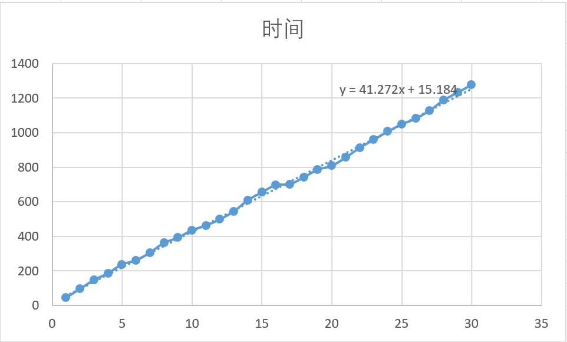

- [x] 重构animation，使用工厂模式而不是lambda
- [ ] 重构loading system
    提供一个素材载入抽象（Godot目前还没有一个很好的解决方案，刚看到有人抱怨到处都是字符串）
    应当能够：
    - 编译时完全确定所有素材所在路径
    - 运行时向系统的其它部分提供索引来获取这些对象（这个索引要稳定）
    - 开发时素材路径发生变化可以一键重新生成路径和索引的对应关系
    - ~~(Optional)自动维护素材缓存，按需加载，实现一个类似Streaming的模块~~由于API设计这条应该没法实现了
    TODO:
    - [x] 设计索引格式
    - [x] 设计素材在模块内部的索引格式
    - [ ] 编写脚本一键重新构建索引
      - [x] 构建全局namespace中的asset索引
      - [ ] 构建group索引
    - [x] 编写模块本体
      - [x] 索引转换
      - [x] 素材打包/分组
      - [x] group load
    - [ ] (Optional)添加缓存逻辑
    - [ ] (Optional)编辑器可视化操作
- [x] 重构Asset，包含存储逻辑，做成统一I/O界面
- [x] benchmark资源加载(一张图40ms，已经超过了60fps要求的16.67ms)
  
- [ ] 异步加载